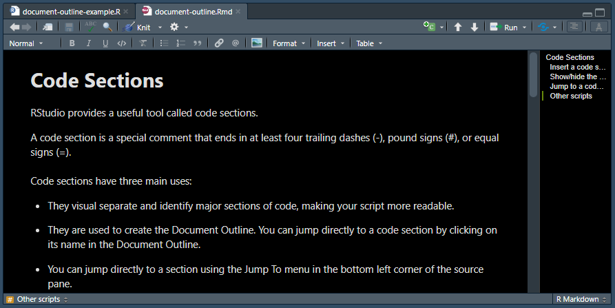

# Code Sections

RStudio provides a useful tool called code sections.

A code section is a special comment that ends in at least four trailing dashes (-), pound signs (\#), or equal signs (=).

Code sections have three main uses:

-   They visual separate and identify major sections of code, making your script more readable.

-   They are used to create the Document Outline. You can jump directly to a code section by clicking on its name in the Document Outline.

-   You can jump directly to a section using the Jump To menu in the bottom left corner of the source pane.

Here is a screenshot of the code sections in action:

{width="100%"}

And here is the code in the script shown in the screenshot above:


``` r
## This script shows an example of using comments to create a document outline

# load packages -----------------------------------------------------------

library(tidyverse)


# read data ---------------------------------------------------------------

data <- read_xl("data.csv")


# plot data --------------------------------------------------------------

ggplot(data) +
  geom_point(aes(x, y))
```

## Insert a code section

To insert a code section in an R script, do one of the following:

-   Use the Insert Section... dialog under the Code menu
-   Use the keyboard shortcut Ctrl+Shift+R / Cmd+Shift+R
-   Add four or more dashes (-) or pound signs (\#) at the end of a comment

For readability, add a blank line above and below each code section comment

## Show/hide the Document Outline

The document outline appears on the right side of the source pane

To toggle the Document Outline on or off, do one of the following:

-   Click the Document Outline button on the right side of the source pane toolbar. It looks like four offset horizontal lines
-   Use the keyboard Shortcut Ctrl-Shift+O / Cmd+Shift+O

## Jump to a code section

You can jump to any code section quickly by doing one of the following:

-   Show Document Outline and click a heading
-   Click the Jump To menu and select a heading

As your scripts become longer, code sections become more useful.

## Other scripts

Code sections and the Document Outline can also be used in other document types.

For example, when you show the Document Outline for an R Markdown document, it shows you all the headings

{width="100%"}
