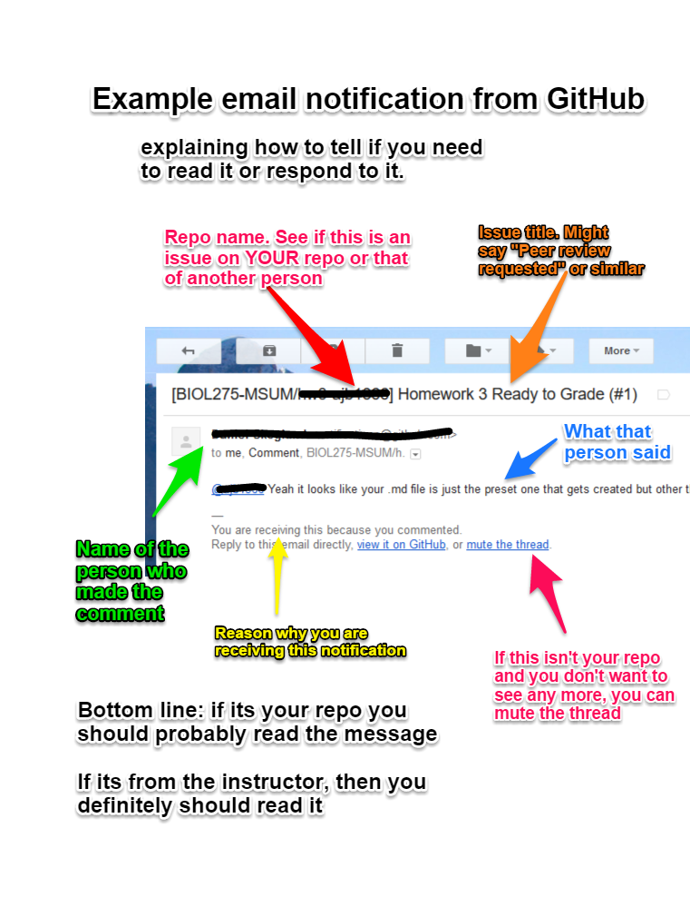

# (PART) Git and GitHub

# GitHub Notifications

Your peers will leave you reviews on GitHub and your instructor give you feedback there. It is important that you receive notifications of these events.

## Subscribing to notifications

Make sure you are signed up to receive notifications by email so you can see this feedback and respond in a timely manner.

When you create an issue, you are automatically signed up for notifications of comments on that issue. Likewise, when you comment on another user's issue, you are automatically signed up for notifications of comments on that issue.

Caution: for any given assignment you may receive a dozen or more notifications:

-   One for each peer review and instructor review on **your repository**
-   One for each peer review and instructor review on **any repository you reviewed**
-   When someone closes an issue you are subscribed to.

*To unsubscribe from comments for any given issue, view this issue online and click "Unsubscribe" or on the notification email click the "mute this thread" link.*

### Notification methods

You can opt to receive either email or online notifications.

-   **Online notifications** show up in your notification area. You can see if you have any new notifications if there is a blue dot on the alarm bell icon on GitHub.

-   **Email notifications** are the best option, so you don't miss an important message.

If you are not receiving email notifications, but you want to, then go to your profile settings and change the appropriate setting.

## Notification emails

When you receive an email notification, it is important that you read it and understand whether you need to respond or not.

The easiest way to do this is to click the link to view the issue online.

You may also want to familiarize yourself with the contents of a notification email so you can decide without viewing the issue online whether or not you need to respond.

Here is a visual guide to notification emails:

[{width="300"}](screenshots/github-notification-email.png)
