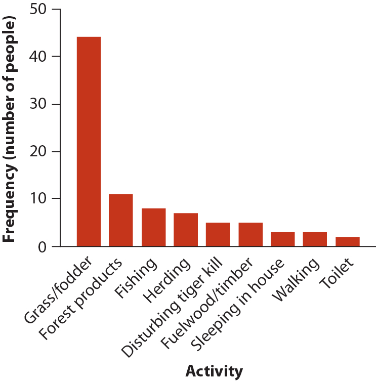

# Introduction to ggplot2

## Objectives

In this lab, you will learn to:

-   Use the layered grammar of graphics:

    -   Create a blank graph using the `ggplot()` function
    -   Add geometric objects to a graph
    -   Define an aesthetic mapping for a graph
    -   Add labels to a graph
    -   Fix some common styling

-   Create a graph showing the distribution of a single variable

    -   Create a bar chart for a categorical variable using the `geom_col()` and `geom_bar()` functions
    -   Arrange the categories in a bar chart by frequency
    -   Create a histogram for a numerical variable using the `geom_histogram()` function
    -   Choose and set appropriate histogram bin widths

-   Set the image width for an R Markdown code chunk

## Introduction

This lab will introduce you to visualizing data using ggplot2.

R has other systems for creating graphs, such as the plotting functions included with base R. At times you may end up searching online for help with you R code. Be sure to add ggplot to any of your search terms so that you end up finding solutions that fit within the requirements of this course.

The instructions below correspond to sections 1, 2, 3, and 6 in the [Data visualisation](https://r4ds.had.co.nz/data-visualisation.html "3 Data visualisation | R for Data Science") chapter of your lab manual, *R for Data Science*. If the steps below do not make sense on their own, please read those sections.

## Project Setup

For this lab you will work in a new RStudio Project under git version control. Here are the steps you should follow to set up your Project:

1.  Claim your repository

    a.  Go to the course D2L page

    b.  Find the Content module for this lab

    c.  Follow the link to claim your repository (repo) on GitHub

        *Note: this link will not appear until the day of your lab. If you want to get ahead, you can always try reading the [Data visualisation](https://r4ds.had.co.nz/data-visualisation.html "3 Data visualisation | R for Data Science") chapter ahead of time*

    d.  Copy the URL for your newly created repository

2.  Create a new project

    a.  Open RStudio
    b.  Click **New Project...** on the File menu or Project menu (upper right)
    c.  In the dialog window, select Version Control and then Git
    d.  Paste the URL for your repo
    e.  Hit tab to autofill the Directory name field. If it does not autofill, then type in the name of your repository as best you can (include the word "lab", the lab number, and your name)
    f.  Click the Browse button and find a good place on your hard drive for this project to live
    g.  Set your Project options. When the project opens, go to Tools \> Project Options... and change the first three drop down menus to "No" (see [Project Options](project-options.html) for detailed instructions and rationale)

3.  Open README.Rmd and edit it, replacing triple underscores "\_\_\_" with your text.

4.  Create a new script

    a.  Click the New File button (upper left) or go to File \> New File

    b.  Select "R script"

    c.  Immediately save your script with a useful name, for example `tutorial-walk-through.R`

For the rest of the lab, you will copying code from this website and paste it into your R script. *Only later, after you have a working R script, will you copy anything into your lab report R Markdown document.*

## Load packages

ggplot2 is one of the core packages in the tidyverse. In the code below, you will load the ggplot2 package and other tidyverse packages. Before you do, get your script off to a nice start by adding a code section. Code sections keep your code organized and makes it easy to jump to specific code sections without scrolling. In a long script, this can be a real time saver. The [Code Sections](code-sections.html) chapter has more details, but for now you can just follow these instructions:

1.  Go to **Code \> Insert Section...** or use the keyboard shortcut Ctrl+Shift+I / Cmd+Shift+I
2.  Type "load packages" in the dialog window and click the **OK** button

As you work through the tutorials, add other code headings as necessary.

Load the tidyverse package by adding this code below the new code section and running it:

```{r show-library-tidyverse, eval=FALSE}
library(tidyverse)
```

That line of code ***loads*** the tidyverse package and the eight core packages within the tidyverse, one of which is ggplot2. The vast majority of your data science needs can be met with those eight packages. While it is possible to load each package individually, for example `library(ggplot2)`, it's usually better to load the tidyverse package because its not often that you only want to use one of the packages in the tidyverse.

When you run the code, you will see a ***message*** in the console like this:

```{r run-library-tidyverse, echo=FALSE}
library(tidyverse)
```

The first part tells you which packages are being loaded. You will notice ggplot2 is on that list. The second part of the message tells you which tidyverse functions conflict with (and override) other functions. Usually those other functions are from base R, but they could also be functions from other packages you had already loaded. If you ever want to use a package that has been overridden with another package, you have to refer to it explicitly by its package *and* function name.

## Bar graphs

Bar graphs are used to show the distribution of a single *categorical* variable.

### Example: tiger data

We will use the data from Example 2.2A in your textbook for this activity. The summary from the textbook is as follows:

> Conflict between humans and tigers threatens tiger populations, kills people, and reduces public support for conservation. Gurung et al. (2008) investigated causes of human deaths by tigers near the protected area of Chitwan National Park, Nepal. Eighty-eight people were killed by 36 individual tigers between 1979 and 2006, mainly within 1 km of the park edge. Table 2.2-1 lists the main activities of people at the time they were killed. Such information may be helpful to identify activities that increase vulnerability to attack.

The dataset consists of one table showing the activities of 88 people at the time they were attacked and killed by tigers near Chitwan National Park, Nepal, from 1979 to 2006.

You can view and explore the data using this interactive table:

```{r tiger-data-table, echo=FALSE, message=FALSE, warning=FALSE, class.ouput='p-3'}
library(DT)
DT::datatable(
  read_csv("https://whitlockschluter.zoology.ubc.ca/wp-content/data/chapter02/chap02e2aDeathsFromTigers.csv"),
  options = list(pageLength = 5)
)
```

Each row in the table represents a sample unit, or person. Thus the sample size is 88.

The variables are:

-   **person**. a number from 1 to 88 identifying which person the data pertains to. While this variable contains a number, it is incorrect to call it a numeric variable. The number was not measured, and it cannot have mathematical functions applied to it such as calculating the mean. The value is really no different than a person's name, which would consist of text. Therefore it is best to consider person a *categorical* variable.

-   **activity**. the person's activity at the time they were attacked and killed. This is a *categorical* variable with a discrete number of possible values.

For our purposes, the only variable of interest is activity. We will not use the person variable.

### Read the tiger data

The next step in your R script is to read the data into R.

First, create a new [code section](code-section.html) named "deaths from tigers"

The data for this and other examples from your textbook can be found on the [book website](https://whitlockschluter.zoology.ubc.ca/). It is stored as a comma-separated values file (.csv).

Read the data from the textbook website using the `read_csv()` function, part of the readr package, and assign it to an object named `tiger_data` using the left assignment operator `<-`. To do that, copy the code in here and paste it into your script. You do not need to follow the link in your web browser or download the data to your computer.

```{r}
tiger_data <- read_csv("https://whitlockschluter.zoology.ubc.ca/wp-content/data/chapter02/chap02e2aDeathsFromTigers.csv")
```

The message you get in your console tells you how the data in the CSV was parsed (interpretted) when it was read into R. You can ignore it for now.

### View the tiger data

You will notice that the data itself did not appear in the console. That's because we assigned it to an object but did not print it. To print the data in the console, type the name of the object into your R script and run it. Alternatively, you can copy and paste the code in the code box below, but ONLY INCLUDE THE CODE BELOW, NOT THE OUTPUT LINES PRECEDED BY \#\>

```{r}
tiger_data                  # print the data in the console
```

The output in the console indicates the object is a tibble (a tidyverse name for a table of data) with 88 observations (rows) and 2 variables (columns).

You can view a list of distinct values taken by a categorical variable by using the `distinct()` function, which returns a table of distinct values taken by the variable. The first argument to the function is the name of the data, the second argument is the name of the variable.

```{r eval=FALSE}
distinct(tiger_data, activity)
```

```{r echo=FALSE}
distinct(tiger_data, activity) %>% 
  print(n = Inf)
```

### Contingency table

If you want to see how many times each value of activity occurs in the data, you can create a contingency table using the `count()` function. Again, the data object is the first argument and the variable name is the second argument.

```{r}
count(tiger_data, activity)
```

As you can see, this function returns another tibble that has two variables: the original one *activity* and a new one *n*, which represents the number of times the variable occurred in the data.

### Make a bar graph

The distribution of a single categorical variable is best visualized using bar graph (also called a bar chart, barchart, or column graph). In this section, you will learn how to create a bar graph.

ggplot uses a layered approach to building a graph. You will learn more about what this means as you build your first graph using the tiger data. Your goal is to create a bar graph similar to the one in the textbook in Figure 2.2-1, which looks like this:

{.text-center width="400"}

The first step is to create a new ggplot using the `ggplot()` function. The first (and for now, only) argument is the data argument. You should set it to the data object you created above. Now run the code:

```{r, fig.width=4.63, fig.asp=1}
ggplot(data = tiger_data)
```

When you plot something in RStudio (i.e. when you create a graph), it will appear in the Plots tab in the lower right pane.

Look at the Plots tab. What do you see? At first you may think it is a blank screen, but actually it is a gray box representing the empty plot. At this point, R knows you want to plot the tiger data, but it doesn't know which variables to plot or how to display the data.

#### Geometric objects and aesthetic mappings

To display the data, we need to add a geometric object. In this case, because we want a bar graph, we will use the `geom_bar()` function. You add the geometric object to the canvas using a plus sign like this:

```{r, fig.width=4.63, fig.asp=1}
ggplot(data = tiger_data) +
  geom_bar(mapping = aes(x = activity))
```

The first (and for now, only) argument to `geom_bar()` is `mapping`, an aesthetic mapping that tells R which variables in the data table *map* to which parts of the graph. An aesthetic mapping is defined by the `aes()` function. `geom_bar()` requires only one aesthetic, the argument `x`, which tells R which variable to put on the x axis.

How did we know what variable to put on the x-axis in the bar graph? That's determined by the purpose to the graph. For this graph, the purpose is to plot the distribution of the activities of people attacked and killed by tigers. But what is the actual variable we want to graph? For that you need to go back and look at the data itself. Print the data in the console again by typing its name and running the line:

```{r, eval=FALSE}
tiger_data
```

The variables are listed on the second row the of the output. You can see they are named *person* and *activity*. Which one is the variable we want to graph? It is *activity*. So in your aesthetic mapping the code `x = activity` can be translated as "put the activity variable on the x axis".

Any variables you map to an aesthetic must be present in the data, and the variable name must appear exactly as it does in the data.

Put this all together, and the way to add a bars to the graph is `geom_bar(mapping = aes(x = activity)`

#### Labels and themes

The result figure, shown above, should look similar to the one in Figure 2.2-1 of your textbook. With a couple of notable exceptions:

1.  The columns should be ordered by height

2.  The color should be red

3.  The axis labels "count" and "activity" should be changed to something more informative

4.  Various theme elements could be improved:

    i.  The font size should be larger
    ii. The axis labels should be bold
    iii. The axis tick labels (the activity names) should be rotated 45 degrees
    iv. The axis ticks should be removed

Let's fix each of those issues in turn.

First, arrange the levels (categories) of activity in descending order by count (i.e. big columns on the left), using a bit of wizardry from the forcats package, one of the core packages in the tidyverse that was loaded when you loaded the tidyverse package. The `fct_infreq()` function changes a variable to factor with the levels defined by how frequently they occur in the data. Inside the `aes()` function, change `x = activity` to `x = fct_infreq(activity)`.

```{r, fig.width=4.63, fig.asp=1}
ggplot(data = tiger_data) +
  geom_bar(mapping = aes(x = fct_infreq(activity)))
```

Second, change color of the columns by adding a `fill` argument to `geom_bar()`. Put a comma after the closing parenthesis of the `aes()` function and add `fill =`. For the fill color, you could try `"red"` or `"darkred"`, but for an exact match use the hex color `"#C5351B"`.

```{r, fig.width=4.63, fig.asp=1}
ggplot(data = tiger_data) +
  geom_bar(mapping = aes(x = fct_infreq(activity)), fill = "#C5351B")
```

Third, add better x- and y-axis labels using the `labs()` function. Axis labels should start with capital letters and, for numeric variables, should include the units of measurement in parentheses. The argument `x` sets the x-axis label while the argument `y` sets the y-axis label. The label text itself should appear in quotation marks. The `x` and `y` arguments should be separated by a comma.

```{r, fig.width=4.63, fig.asp=1}
ggplot(data = tiger_data) +
  geom_bar(mapping = aes(x = fct_infreq(activity)), fill = "#C5351B") +
  labs(x = "Activity", y = "Frequency (number of people)")
```

Fourth, fix the look of the graph by using:

-   the `width` argument of `geom_bar()` to set make the bars (columns) a bit narrower

-   `scale_y_continuous()` to set the y-axis limits to 0 and 50, with no buffer

-   `theme_classic()` to remove the background color, adds axis lines, and increases the base font size

-   `theme()` to change various other theme elements such as:

    -   Make the axis labels bold

    -   Make the x- and y-axis text black and larger

    -   Make the x-axis text angled and right justified

    -   Remove the x-axis tick marks

```{r, fig.width=4.63, fig.asp=1}
ggplot(data = tiger_data) +
  geom_bar(mapping = aes(x = fct_infreq(activity)), fill = "#C5351B", 
           width = .8) +
  labs(x = "Activity", y = "Frequency (number of people)") +
  scale_y_continuous(limits = c(0, 50), expand = expansion(mult = 0)) +
  theme_classic(base_size = 12) +
  theme(
    axis.title = element_text(face = "bold"),
    axis.text = element_text(color = "black", size = rel(1)),
    axis.text.x = element_text(angle = 45, hjust = 1),
    axis.ticks.x = element_blank()
  )
```

Compare your figure to the original above. Not bad! This one, however, can be inserted into any document at any size and resolution. And most importantly, your code documents how you created the graph, ensuring the figure could be reproduced by anyone.

Note that you could get pretty close with just the first three lines of code and perhaps the one theme element to rotate the axis text labels.

## Histograms

Histograms are used to show the distribution of a single numerical variable.

Now that you know the basics creating a ggplot, creating a histogram will require relatively little explanation.

### Example: bird data

We will use the data from Example 2.2B in your textbook for this activity. The summary from the textbook is as follows:

> How many species are common and how many are rare? One way to address this question is to construct a frequency distribution of species abundance. The data in Table 2.2-2 are from a survey of the breeding birds of Organ Pipe Cactus National Monument in southern Arizona, USA. The measurements were extracted from the North American Breeding Bird Survey, a continent-wide data set of estimated bird numbers (Sauer et al. 2003)

The dataset consists of one table showing the abundance of 43 species in Organ Pipe National. Monument.

You can view and explore the data using this interactive table:

```{r bird-data-table, echo=FALSE, message=FALSE, warning=FALSE, class.ouput='p-3'}
DT::datatable(
  read_csv("https://whitlockschluter.zoology.ubc.ca/wp-content/data/chapter02/chap02e2bDesertBirdAbundance.csv"),
  options = list(pageLength = 5)
)
```

Each row in the table represents a sample unit, or person. Thus the sample size is 88.

The variables are:

-   **species**. the name of the bird species, a *categorical* variable.
-   **abundance**. the species's abundance, a *numerical* variable consisting of positive integers.

For our purposes, the only variable of interest is *abundance*. We will not use the species variable.

### Read and view the bird data

Create a new code section in your script named "bird abundances" and read the data from the textbook website:

```{r}
bird_data <- read_csv("https://whitlockschluter.zoology.ubc.ca/wp-content/data/chapter02/chap02e2bDesertBirdAbundance.csv")

bird_data                  # print the data in the console

```

The output in the console indicates the object is a tibble with 43 observations (rows) and 2 variables (columns): species and abundance.

It also indicates abundance has a data type of \<dbl\>, which is short for double, a numeric value with up to 18 decimal places. In other words, it's *numerical* variable. The species variable, on the other hand, has a data type of \<chr\>, short for character, which means its a categorical variable.

Because abundance is numerical, not categorical, it does not make sense to view its distinct values with \`distinct, or to create a contingency table showing the number of times each value occurs.

So let's get straight to the histogram.

### Make a histogram

Like all ggplots, a histogram begins with a blank canvas. Notice that we set the data argument to `bird_data` this time rather than `tiger_data`.

```{r, eval=FALSE}
ggplot(data = bird_data)
```

While we used `geom_bar()` to create a bar graph, we will use `geom_histogram()` to create a histogram. The aesthetic mapping, however, is the same. Both require you to map the `x` argument, i.e. tell R which variable is on the x-axis. Because we are interested in looking at the distribution of abundance, we set the `x` argument to `abundance`:

```{r, fig.width=4.63, fig.asp=1}
ggplot(data = bird_data) +
  geom_histogram(mapping = aes(x = abundance))
```

You will see a message in your console warning you that R used the default number of bins, which is 30. The one in your textbook uses bins that fall on the number 0, 50, 100, etc. Let's try setting the bin width instead of the number of bins:

```{r, fig.width=4.63, fig.asp=1}
ggplot(data = bird_data) +
  geom_histogram(mapping = aes(x = abundance), binwidth = 50)
```

The number of bins looks better, but it appears the first bin is centered around zero rather than starting at zero. You can fix this with the boundary argument, which tells R where one of the bin boundaries is (all other boundaries can be inferred from that because the bin width is also set). Thus the boundaries will be 0, 50, 100, etc.

```{r, fig.width=4.63, fig.asp=1}
ggplot(data = bird_data) +
  geom_histogram(mapping = aes(x = abundance), binwidth = 50,
                 boundary = 0, closed = "left")
```

This looks better, but not quite right. If you look at the raw data, you will see one data point for Gila woodpecker with an abundance of 300. Looking at this figure, it's obvious that the value is being included in the bin to the left of 300 rather than the one to the right. In other words, the bins are 250-299, 300-349. We really want them to be 250-300 and 301-350.

Set the `closed` argument to `"left"` to change it so the left edge of the bin is included in the bin, not the right edge. The quick-minded might wonder if that makes the first bin (which includes both zero and 50) wider than the others. In short, I don't know but it doesn't matter here because there are no species in the dataset with an abundance of zero.

```{r, fig.width=4, fig.asp=1}
ggplot(data = bird_data) +
  geom_histogram(mapping = aes(x = abundance), binwidth = 50,
                 boundary = 0, closed = "left")
```

And finally, clean it up with some axis labels and styling changes:

```{r, fig.width=4, fig.asp=1}
ggplot(data = bird_data) +
  geom_histogram(mapping = aes(x = abundance), binwidth = 50,
                 boundary = 0, closed = "left", 
                 fill = "#C5351B", color = "black") +
  labs(x = "Abundance", y = "Frequency (number of species)") +
  scale_y_continuous(breaks = seq(0, 30, 5), limits = c(0, 30), 
                     expand = expansion(mult = 0)) +
  scale_x_continuous(breaks = seq(0, 600, 100)) +
  theme_classic() +
  theme(
    axis.title = element_text(face = "bold"),
    axis.text = element_text(color = "black", size = rel(1))
  )
```

## Your assignment

### Instructions

Your assignment is to demonstrate that you can create and interpret graphs using ggplot.

1.  First, create a new ***R script*** in your lab 3 repository where you will build the code for your analysis. DO NOT TRY TO WRITE YOUR CODE IN YOUR LAB REPORT RMD. Keep your script neat with code sections and descriptive comments throughout.

2.  Read the intro to each dataset ([Fireflies data], [Bird orders data]) and write the code *in your R script* to perform each analysis requested.

3.  *After* you have a working R script, complete your lab report R Markdown document. Open your lab-report.Rmd and replace all triple underscores "\_\_\_" with your answers. Insert R code chunks where necessary and paste in code from your R script.

4.  Put links to your Lab Report and any R scripts in your README

5.  Knit your README.Rmd and lab-report.Rmd

6.  Commit all changes and push. You can either do this step-by-step as your build your script and R Markdown documents, one file or code chunk at a time, or all at once at the end.

7.  Conduct a round of peer review. Use the [Grading Rubric] below. Put links to any peer review Issues you are involved in (as a reviewer or reviewee) into your Lab Report (There is a section in the template near the bottom).

8.  Make any changes necessitated by peer review. It's usually good to fix any code in your script first, to make sure it works, then copy the new code to your R Markdown document.

9.  Save, knit, commit, and push. Save changes to any scripts, knit any updated Rmd files, commit all changes, and push to GitHub.

10. VERIFY ALL CHANGES ON YOUR REPO ON GITHUB. Look at your README, Lab Report, and any R scripts to make sure your changes actually made it to GitHub. Make sure the links on your README work.

11. Submit your assignment by copying the URL for your GitHub repository and pasting it into the appropriate Assignment Submission folder on D2L.

### Fireflies data

This comes from Assignment question \#19 in your textbook.

> Male fireflies of the species *Photinus ignitus* attract females with pulses of light. Flashes of longer duration seem to attract the most females. During mating, the male transfers a spermatophore to the female. Besides containing sperm, the spermatophore is rich in protein that is distributed by the female to her fertilized eggs. The data below are measurements of spermatophore mass (in mg) of 35 males (Cratsley and Lewis 2003). This question comes from your textbook.

The path to the data is `"https://whitlockschluter.zoology.ubc.ca/wp-content/data/chapter02/chap02q19FireflySpermatophoreMass.csv"`

**Create a graph depicting the frequency distribution of mass measurements. It should have legible text and appropriate axis labels.**

### Bird orders data

> The ebird_taxonomy dataset in the auk package is a simplified version of the taxonomy used by eBird. This taxonomy is based on the Clements Checklist. The dataset contains all known species of birds and their taxonomic order and family. Each observation (row) in the dataset represents a unique bird species.

Add this code to your script to load the auk package and create a data object named birds, which you will use for your analysis.

```{r, eval=FALSE}
library(auk)                          # load the auk package
birds <- ebird_taxonomy %>%           # start with the ebird_taxonomy data
  as_tibble() %>%                     # tibbles print better in the console
  filter(category == "species")       # remove non-species taxa
```

**Create a graph depicting the distribution of orders in the birds dataset. Sort the orders with the most frequent on the left.**

### Grading Rubric

You will be assessed based on the following rubric:

-   GitHub Classroom repository claimed

-   R script

    -   Good organization

        -   Code sections make sense

        -   Code goes in correct order, e.g.

            -   load packages before using them
            -   read or load data before using it

        -   Blank lines between code chunks to make it easy to read

    -   Has sufficient comments

        -   At top, a line explaining purpose of the script
        -   Each code chunk has a comment

    -   Code for plots works

-   R Markdown document

    -   Correct YAML header

    -   Questions answered correctly

    -   Code for figures

    -   Figures are correct

        -   Figures look good (text appropriate size, etc)
        -   Axis labels are correct

    -   Format of report is not significantly changed from the template (answers are easily distinguished from questions.

-   Lab report has been peer-reviewed at least once

-   README is complete and includes links to your peer reviews

-   Submitted link to repository on D2L
