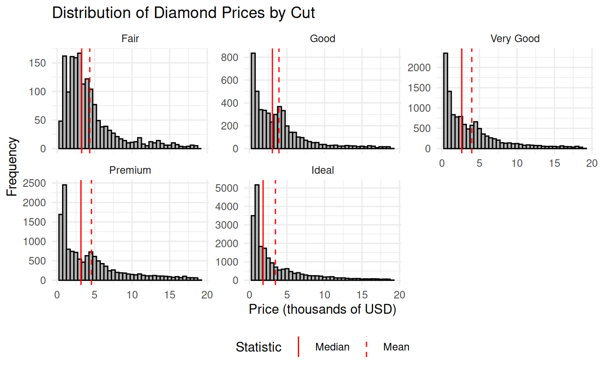
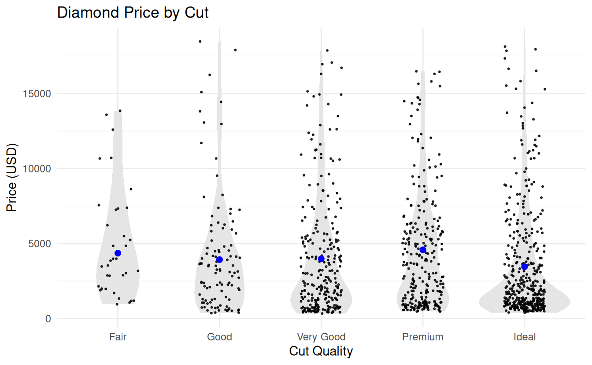

# Lab 7: Data summarizing

## Student Learning Outcomes

By the end of this lab, you will be able to:

-   Calculate group-wise summary statistics (mean, standard deviation, sample size, and confidence intervals) for a continuous variable across levels of a categorical variable.
-   Use faceted histograms to compare the distribution of a continuous variable across groups.
-   Create strip plots overlaid with violin plots, group means, and confidence intervals using `ggplot2`.
-   Select and interpret appropriate visualizations to explore the relationship between a categorical variable and a continuous variable.
-   Communicate data patterns using well-labeled and appropriately styled visualizations.

## Introduction

When exploring a dataset, one of the most common tasks is comparing a continuous variable across the levels of a categorical variable. For example, does body mass differ between penguin species? Does diamond price vary by cut? Before running statistical models or formal tests, it's important to visualize these relationships so you can understand the structure of your data, spot potential outliers, and assess whether assumptions for analysis might be met.

In this lab, you'll focus on two powerful tools for visualizing how a continuous variable varies across categories: faceted histograms and strip plots with overlaid summaries.

A **faceted histogram** is a good first step when you want to compare the overall shape of a continuous variable across groups. Rather than layering multiple distributions on a single plot (which often leads to visual clutter), faceting creates side-by-side histograms—one for each group—so that you can clearly see differences in spread, skew, and modality. This is especially useful early in the data exploration process when you're trying to build an intuitive understanding of how your variable behaves across groups.

Once you’ve examined the distributions, a **strip plot** offers a cleaner and more precise way to compare values between groups. Like a boxplot, it summarizes the distribution of a variable—but unlike a boxplot, a strip plot shows the actual raw data points, which gives you a better sense of sample size, spread, and unusual values. In this lab, you’ll enhance strip plots by adding violin plots (to show the shape of the distribution), the group mean (rather than the median), and 95% confidence intervals for each mean. This approach emphasizes estimation and visualization of group differences using interpretable summaries.

To construct these summaries, you will calculate the following statistics for each group:

-   The **mean** of the continuous variable:\
    $$
    \bar{Y} = \frac{1}{n} \sum_{i=1}^{n} Y_i
    $$

-   The **standard deviation**:\
    $$
    s = \sqrt{\frac{1}{n - 1} \sum_{i=1}^{n} (Y_i - \bar{Y})^2}
    $$

-   The **95% confidence interval for the mean**:\
    $$
    \bar{Y} - t_{\alpha/2,\,df} \cdot SE_{\bar{Y}} < \mu < \bar{Y} + t_{\alpha/2,\,df} \cdot SE_{\bar{Y}}
    $$\
    where:

    -   $\bar{Y}$ is the sample mean
    -   $SE_{\bar{Y}} = \dfrac{s}{\sqrt{n}}$ is the standard error of the mean
    -   $t_{0.025,\,df}$ is the critical value from the t-distribution with $df = n - 1$ degrees of freedom

-   The **95% confidence interval for the standard deviation**:\
    $$
    \sqrt{\frac{(n - 1) s^2}{\chi^2_{1 - \alpha/2}}} < \sigma < \sqrt{\frac{(n - 1) s^2}{\chi^2_{\alpha/2}}}
    $$\
    where:

    -   $s$ is the sample standard deviation
    -   $n$ is the sample size
    -   $\chi^2_{\alpha/2}$ and $\chi^2_{1 - \alpha/2}$ are critical values from the chi-square distribution with $n - 1$ degrees of freedom

This interval tells you the range of plausible values for the population standard deviation, based on your sample. Though less commonly visualized, it helps assess uncertainty in variability across groups.

In this lab assignment, you'll first work see a fully developed example using the `diamonds` dataset to see how to create group summaries and effective visualizations. Then you'll apply the same techniques to the `penguins` dataset, answering questions and generating your own analysis using the skills you've learned. \## Packages

In this lab you will use functions and datasets from the **dplyr** and **ggplot2** packages. While you could load those packages individually, in this course you are encouraged to always load the entire **tidyverse** set of packages. In addition, you will be using the Palmer penguins dataset from the **palmerpenguins** package.

## Example

This example shows how to explore the relationship between diamond price and cut using the `diamonds` dataset from the `ggplot2` package. The variable `cut` is a categorical variable describing the quality of the diamond’s cut, ranging from Fair to Ideal. Because cut influences how well a diamond reflects light, we might expect it to be associated with differences in price.

We’ll walk through loading packages, summarizing price by cut, and creating two types of plots: faceted histograms to show the distribution of prices by cut, and strip plots with overlaid violin plots, means, and confidence intervals.


``` r
# load packages ------------------------------

library(tidyverse)


# summarize price by cut ---------------------

diamond_summary <- 
  diamonds %>%
  group_by(cut) %>%
  summarize(
    median_price = median(price, na.rm = TRUE),
    mean_price = mean(price, na.rm = TRUE),
    std_dev_price = sd(price, na.rm = TRUE),
    sample_size = sum(!is.na(price)),
    std_err_mean = std_dev_price / sqrt(sample_size),
    t_crit = qt(0.975, df = sample_size - 1),
    ci_mean_lower = mean_price - t_crit * std_err_mean,
    ci_mean_upper = mean_price + t_crit * std_err_mean,
    chi2_lower = qchisq(0.975, df = sample_size - 1),
    chi2_upper = qchisq(0.025, df = sample_size - 1),
    ci_sd_lower = sqrt((sample_size - 1) * std_dev_price^2 / chi2_lower),
    ci_sd_upper = sqrt((sample_size - 1) * std_dev_price^2 / chi2_upper)
  ) |> 
  print()
```

```
#> # A tibble: 5 × 13
#>   cut      median_price mean_price std_dev_price sample_size std_err_mean t_crit
#>   <ord>           <dbl>      <dbl>         <dbl>       <int>        <dbl>  <dbl>
#> 1 Fair            3282       4359.         3560.        1610         88.7   1.96
#> 2 Good            3050.      3929.         3682.        4906         52.6   1.96
#> 3 Very Go…        2648       3982.         3936.       12082         35.8   1.96
#> 4 Premium         3185       4584.         4349.       13791         37.0   1.96
#> 5 Ideal           1810       3458.         3808.       21551         25.9   1.96
#> # ℹ 6 more variables: ci_mean_lower <dbl>, ci_mean_upper <dbl>,
#> #   chi2_lower <dbl>, chi2_upper <dbl>, ci_sd_lower <dbl>, ci_sd_upper <dbl>
```

``` r
# Faceted histograms ------------------------

# Prepare a long-format data frame for 
#   vertical lines
diamond_lines <- 
  diamond_summary |> 
  select(cut, mean_price, median_price) |> 
  pivot_longer(
    cols = c(mean_price, median_price),
    names_to = "statistic",
    values_to = "value"
  ) |> 
  mutate(
    # make the statistic names readable
    statistic = recode(
      statistic,
      median_price = "Median",
      mean_price = "Mean",
    ),
    # ensure order in legend
    statistic = factor(   
      statistic, 
      levels = c("Median", "Mean")
    )
  ) |> 
  print()
```

```
#> # A tibble: 10 × 3
#>   cut       statistic value
#>   <ord>     <fct>     <dbl>
#> 1 Fair      Mean      4359.
#> 2 Fair      Median    3282 
#> 3 Good      Mean      3929.
#> 4 Good      Median    3050.
#> 5 Very Good Mean      3982.
#> 6 Very Good Median    2648 
#> # ℹ 4 more rows
```

``` r
# Create the plot
ggplot(diamonds, aes(x = price / 1000)) +
  geom_histogram(binwidth = 0.5, fill = "gray70", color = "black") +
  geom_vline(
    data = diamond_lines,
    aes(xintercept = value / 1000, linetype = statistic),
    color = "red",
    show.legend = TRUE
  ) +
  scale_linetype_manual(values = c("Mean" = "dashed", "Median" = "solid")) +
  facet_wrap(~ cut, scales = "free_y") +
  labs(
    title = "Distribution of Diamond Prices by Cut",
    x = "Price (thousands of USD)",
    y = "Frequency",
    linetype = "Statistic"
  ) +
  theme_minimal() +
  theme(legend.position = "bottom")


# Strip plot with violin and means ----------
diamonds |> 
  sample_frac(.02) |> # only for big data sets
  ggplot(aes(x = cut, y = price)) +
  geom_violin(fill = "gray90", color = NA) +
  geom_jitter(
    width = 0.2, alpha = 0.8, size = 0.4
  ) +
  geom_linerange(
    data = diamond_summary,
    aes(x = cut, y = NULL,
        ymin = ci_mean_lower, 
        ymax = ci_mean_upper),
    color = "blue",
    linewidth = 0.8
  ) +
  geom_point(
    data = diamond_summary,
    aes(x = cut, y = mean_price),
    color = "blue",
    size = 2
  ) +
  labs(
    title = "Diamond Price by Cut",
    x = "Cut Quality",
    y = "Price (USD)"
  ) +
  theme_minimal()
```



## Instructions

1.  Claim your personal lab 7 repository on GitHub by following the link on D2L in the corresponding Content module.
2.  Clone your repository to your computer using the **New Project \> Version Control \> Git** method
3.  Set your Global Options in RStudio
    a.  Open RStudio
    b.  Go to the Tools menu \> Global Options
    c.  Under **General \> Basic**, uncheck the boxes under Workspace and History
    d.  Under **Code \> Editing**, check the box for "Use native pipe operator"
    e.  Under **Code \> Completion**, check the box for "Use tab for multiline autocompletions"
4.  Make your first commit by adding the R project file (lab-7-data-summarizing-your-name.RProj) and gitignore file (.gitignore) to Git.
    -   The commit message should be "Add RProj and gitignore files"
5.  Create a new `questions.R` script. This is where you will write the code to answer the questions below.
6.  If it is not already installed, then install the **tidyverse** and **palmerpenguins** packages.
    -   Best practice: put the library command in your script, click save, and click the Install button that appears on the banner at the top of your source pane (your R script).
    -   Alternative method: use the **Packages** tab in RStudio (lower right pane) to check for the presence of the two packages, and to install them if necessary.
    -   Not recommended: typing `install.packages()` into the console
    -   Definitely not recommended: putting `install.packages()` in your R script.
7.  Under the section `# load packages ----`
    -   Write the code to load your packages.
8.  Under the section `# questions ----`
    -   Put placeholder comments for the questions below.
    -   Below each comment, write code to perform the requested action
    -   Do not assign the results a name (i.e. do not create an object) using the assignment operator *unless instructed to do so*.
    -   For eah question, only include the minimum code necessary. Do not include every version of code you tried.
9.  Save your script, commit it to Git, and push the commit to GitHub
10. To submit your assignment:
    a.  In a web browser, navigate to your Git repository, copy the URL
    b.  Paste that as your assignment in the D2L submission box for the lab

## Questions

All questions work with the penguins dataset.

1.  Calculate the mean bill depth of penguins *by species* (one mean per species)
    -   Use the `summarize()` function described in [R4DS 3.5.2 `summarize()`](https://r4ds.hadley.nz/data-transform.html#sec-summarize)
    -   Group by species; there are two ways to do this:
        -   Include the `group_by()` function in the pipeline before the summarize; see [R4DS 3.4.1 group_by()](https://r4ds.hadley.nz/data-transform.html#group_by) for details and an example
        -   Alternative: use the experimental new `.by =` argument in the summarize function itself, as described in [R4DS 3.5.6 .by](https://r4ds.hadley.nz/data-transform.html#by).
    -   Suggestion: Name the new variable **mean_bd**
    -   Tip: use the `mean()` function to calculate the mean, for example `mean_bd = mean(flipper_length_mm)`
    -   Warning: If you see an `NA` in the mean column, it is because there are missing values in the data used to calculate the mean. Use the `na.rm` argument to `mean()`, for example `mean(flipper_length_mm, na.rm = TRUE)` to exclude missing values when calculating the mean
2.  For each species, calculate the mean bill depth, the number of penguins in the dataset, and the number of values used to calculate the mean
    -   In your `summarize()` function, you can calculate multiple variables at once; see the third code block in [R4DS 3.5.2 `summarize()`](https://r4ds.hadley.nz/data-transform.html#sec-summarize) for an example
    -   The final data frame should have *exactly* the following columns:
        -   **`n_rows`** (number of penguins in the dataset): this includes rows with missing values for bill depth; calculate using the `n()` function, which does not take any arguments, for example `n = n()`
        -   **`n_nas`** (number of NAs): the number of missing values for bill depth; use a trick to do this: `NAs = sum(is.na(bill_length_mm))`
        -   **`sample_size`** (sample size): the number of values used to calculate bill depth; use a trick to do this: `sample_size = sum(!is.na(bill_length_mm))`
        -   **`mean_bd`** (mean bill depth): calculate using `mean()` with `na.rm=TRUE`
    -   Note how `n` and `sampl_size` are not the same; ask yourself, which should you use to calculate a standard error of the mean?
3.  Calculate mean bill depth by species, include a 95% confidence interval. The final data frame should have the following columns:
    -   **sampl_size** (sample size): use the equation from question 2 to calculate

    -   **mean_bd** (sample mean): average bill depth

    -   **std_dev_bd** (sample standard deviation): use the `sd()` function to calculate

    -   **std_err_mean** (standard error of the mean): use the equation above $SE_{\bar{Y}} = \frac{s}{\sqrt{n}}$

    -   **t_crit** (t critical value): use the `qt()` function to calculate the t-value needed for a confidence interval

        -   This function takes two main arguments: `p` and `df`.
        -   `p` is the cumulative probability, meaning the area under the t-distribution curve to the **left** of the desired t-value.
            -   For a two-tailed 95% confidence interval, use `p = 0.975` (because 2.5% is in the upper tail).
        -   df is the degrees of freedom and is typically calculated as the sample size minus one: `df = sampl_size - 1`
        -   example: `qt(p = 0.975, df = sampl_size - 1)`
        -   **ci_mean_upper** (upper bound to the confidence interval): calculate using the mean, t-value, and standard error.
        -   **ci_mean_lower** (lower bound): calculate similar to the upper bound
4.  Calculate the mean **body mass** by species, including a 95% confidence interval for the mean, and a 95% confidence interval for the standard deviation.
    -   Calculate the mean and confidence interval as above
    -   Also calculate the confidence interval for the standard deviation using the equation $\sqrt{\frac{(n - 1) s^2}{\chi^2_{1 - \alpha/2}}} < \sigma < \sqrt{\frac{(n - 1) s^2}{\chi^2_{\alpha/2}}}$ where $\sigma$ is the population standard deviation, $s$ is the sample standard deviation, $n$ is the sample size, and $\chi^2_{1 - \alpha/2}$ and $\chi^2_{\alpha/2}$ are the critical values from the chi-squared distribution.
    -   The final data frame should have the following columns:
        -   **sample_size** (sample size)
        -   **mean_bm** (mean body mass)
        -   **std_dev_bm** (standard deviation of body mass)
        -   **ci_mean_upper** (upper bound to the confidence interval)
        -   **ci_mean_lower** (lower bound to the confidence interval)
        -   **ci_std_dev_upper** (upper bound to the confidence interval)
        -   **ci_std_dev_lower** (lower bound to the confidence interval)
5.  Create a single graph that shows the distribution of penguin body masses using three histograms, one for each species; include vertical lines showing the median and mean body masses for each species
    -   Before plotting, you need to prepare the medians and means for adding to the histograms. To add both statistics to the same graph and label them appropriately, you need to reshape the summary data into long format using `pivot_longer()`
        -   Select the variables you need, species, median_bm, and mean_bm.
        -   Use `pivot_longer()` to put the name of the statistic, "Mean" or "Median", in a new column named **statistic**, and the values in a new column named **value**.
        -   In the `geom_vline()` set the data argument to the vertical line dataset you just created
        -   Be sure to add the `x=grouping_variable` to the aesthetic for the vline. Because you are using a different dataset for this geom, it will not inherit the x aesthetic from the ggplot call.
    -   geom_histogram() creates the histogram
    -   facet_wrap() separates the three species into different panels
        -   The argument to facet wrap should be an equation (use the tilde `~`) with the name of the grouping variable
        -   Example: to facet the diamonds data by cut, use `facet_wrap(~cut)`
6.  Create a strip plot that shows the distribution of penguin body masses by species
    -   Include the raw data (geom_point)
    -   Include violin plots (geom_violin)
    -   Include the means (geom_point)
    -   Include the confidence intervals for the mean (geom_errorbar)
