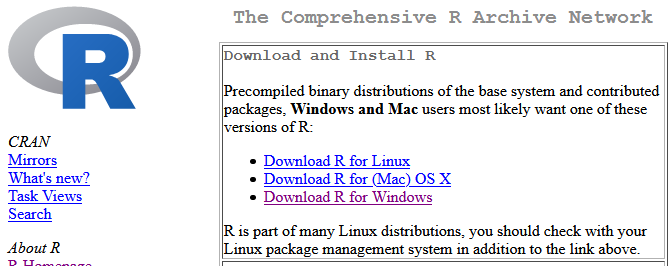

# (PART) Appendices {-}

# Laptop Setup

Most students use the computers in the lab room to complete their labs. These computers already have all the necessary software installed, so you don't have to do anything to get started.

Some students may want to work on their own personal laptop or desktop computer instead of, or in addition to, the lab computers. If that is the case, you have two basic options:

-   Install the software on your machine, including R, RStudio, and Git; see the next three sections for instructions.

-   Use Posit Cloud, an online service that is essentially R, RStudio, and Git, all in a web browser. The only requirement is that you have an internet connection. See Posit Cloud below for instructions.

## Option 1: Install Software

### Install R

You must install R before you install RStudio.

Directions for installing R:

1.  Go to <https://cran.rstudio.com/>
2.  Under *Download and Install R*, follow the link for your operating system, Linux, (Mac) OS X, or Windows.

```{r echo = FALSE, out.width = "75%"}

```

3.  If you chose Download R for (Mac) OS X:

    a.  Download the binary file. The link will say something like "R-`paste0(R.Version()$major, ".", R.Version()$minor)`.pkg", but the version number may be different if a newer version has been released.
    b.  Open the file and your Mac will install R. If you are prompted for options during installation, just select the default options.

4.  If you chose Download R for Windows:

    a.  Click the link for "base" or "install for the first time"
    b.  Download the installer. The link will say something like "Download R 4.0.3 for Windows", but the version number may be different if a newer version has been released.
    c.  Open the file and Windows will install R. If you are prompted for options during installation, just select the default options.

### Install RStudio

Make sure you have installed R before you try to install RStudio.

Directions for installing RStudio:

1.  Go to <https://rstudio.com/products/rstudio/download/>
2.  Scroll down about two thirds of the page. You will see a heading that says RStudio Desktop `RStudio.Version()$version`.
3.  Click the big blue button that says "DOWNLOAD STUDIO FOR WINDOWS"

```{r echo = FALSE, out.width = "75%"}
knitr::include_graphics("screenshots/download-rstudio.png")
```

### Install Git

Quick instructions are provided below. For more detailed instructions, see the Git documentation Chapter [1.5 Getting Started - Installing Git](https://git-scm.com/book/en/v2/Getting-Started-Installing-Git).

#### Installing on Windows

On the Git webiste, go to [Download for Windows](https://git-scm.com/download/win) and click the first link to download the latest 64-bit version of Git for Windows.

#### Installing on macOS

See the instructions at in the Git documentation [1.5 Getting Started - Installing Git](https://git-scm.com/book/en/v2/Getting-Started-Installing-Git).

## Options 2:  Use Posit Cloud

If you don't want to install the software on your computer, your other option is to use Posit Cloud <https://rstudio.cloud/> in a web browser.

You have to create a free account, and you get 25 compute hours a month for free. That translates to 50 hours of having the project open, which is probably enough for most student uses.

## Introduce yourself to Git

Whether you install the software yourself or use Posit Cloud, you will need to introduce yourself to Git before you can make a commit. Quick instructions are provided below. For more detailed instructions, see the Git documentation [1.6 Getting Started - First-Time Git Setup](https://git-scm.com/book/en/v2/Getting-Started-First-Time-Git-Setup).

First, open a Git command line in one of the following three ways (the first is the easiest):

-   Click the Terminal tab in RStudio (bottom left pane)

-   Click the Git tab in RStudio (top right pane), click the More icon (a blue gear), and click Shell... which will open a shell window

-   In Windows, run the application Git CMD, for example by clicking on the icon in the Windows Start Menu

-   In macOS, open a command line

Second, run the following two commands.

    $ git config --global user.name "Jane Doe"
    $ git config --global user.email janedoe@example.com

replacing the example name and email address with your own. The username and email address do *not* need to match any other username or email address you have, they are simply used for Git to record who made a particular commit.

You should enter one command, press enter, then enter the second command, and press enter.

Note, do not enter the \$ sign at the beginning, that is just how we note a command prompt.
