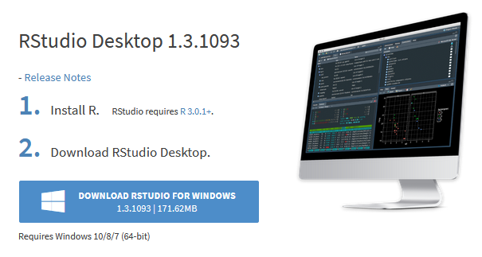

# (PART) Appendices {.unnumbered}

# Laptop Setup

Most students use the computers in the lab room to complete their labs. These computers already have all the necessary software installed, so you don't have to do anything to get started.

Some students may want to work on their own personal laptop or desktop computer instead of, or in addition to, the lab computers. If that is the case, you have two basic options:

-   [Option 1: Use Posit Cloud], an online service that is essentially R, RStudio, and Git, all in a web browser. The only requirement is that you have an internet connection. See Posit Cloud below for instructions.

-   [Option 2: Install the software] on your machine, including R, RStudio, and Git; see the next three sections for instructions.

## Option 1: Use Posit Cloud

If you don't want to install the software on your computer, The easiest way to use R, RStudio, and Git on your own computer is to use Posit Cloud <https://rstudio.cloud/> in a web browser.

You have to create a free account, and you get 25 compute hours a month for free. That translates to 50 hours of having the project open, which is probably enough for most student uses.

## Option 2: Install the Software

If you really want to install the software on your own computer, here are instructions. Know that campus IT will probably not offer any help with this.

The three software programs you need to install are:

-   Install R

-   Install RStudio

-   Install Git

### Install R

You must install R before you install RStudio.

Directions for installing R:

1.  Go to <https://cran.rstudio.com/>
2.  Under *Download and Install R*, follow the link for your operating system, Linux, (Mac) OS X, or Windows.

3.  If you chose Download R for (Mac) OS X:

    a.  Download the binary file. The link will say something like "R-`paste0(R.Version()$major, ".", R.Version()$minor)`.pkg", but the version number may be different if a newer version has been released.
    b.  Open the file and your Mac will install R. If you are prompted for options during installation, just select the default options.

4.  If you chose Download R for Windows:

    a.  Click the link for "base" or "install for the first time"
    b.  Download the installer. The link will say something like "Download R 4.0.3 for Windows", but the version number may be different if a newer version has been released.
    c.  Open the file and Windows will install R. If you are prompted for options during installation, just select the default options.

### Install RStudio

Make sure you have installed R before you try to install RStudio.

Directions for installing RStudio:

1.  Go to <https://rstudio.com/products/rstudio/download/>
2.  Scroll down about two thirds of the page. You will see a heading that says RStudio Desktop `RStudio.Version()$version`.
3.  Click the big blue button that says "DOWNLOAD STUDIO FOR WINDOWS"

### Install Git

See [Git Setup](git-setup.html) for instructions.
