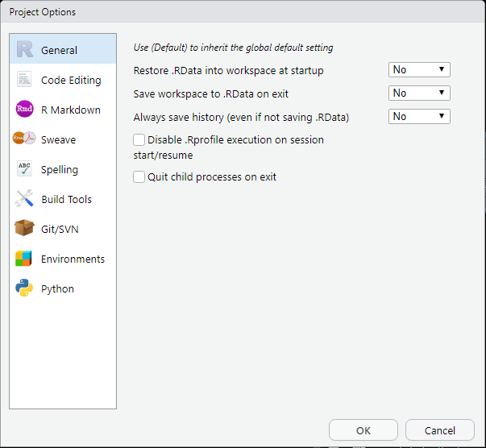

# (PART) Using RStudio

# Project Options

Each RStudio project consists of, at a minimum, a directory (aka folder) and an RStudio Project file. This file has the same name as the Project directory and ends with .RProj.

One of the main purposes of the RProj file is to store the Project Settings.

You can see the Project Settings in two ways:

-   Go to Tools \> Project Options...

-   In the Files tab, click on the RProj file

Both methods cause a dialog window to pop up showing the project options.

{width="400"}

### Suggested changes to default settings

The main thing is to change the General settings to avoid loading or saving the Project Workspace and avoid saving your History.

Change the project settings as follows:

1.  Open the Project Options dialog

2.  Select the **General** tab on the left

3.  Change the following settings from **(Default)** to **No**

    a.  **Restore .RData into workspace at startup**

    b.  **Save workspace to .RData on exit**

    c.  **Always save History (even if not saving .RData)**

4.  Click the **OK** button

Note: You may also wish to change your Global Settings in the same way. It is still important, however to change the project settings.

If your Project is under version control (using Git), then your .RProj file will now show as being modified. You should commit the changes to it and, if the repository is also on GitHub, push the commit. Don't forget to give a useful commit message like "Change project general settings from default to no".
